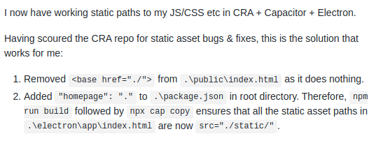

# Ionic-React-BMI

## Overview

Proof of concept. Web app transformed into an Android app that calculates the Mass-Body-Index using two input fields and two buttons. Inputs are accepted as meters/kgs or feet/lbs.

## Build and deploy

### Android

This app was developed using React and Ionic (for the style and behaviour of the components).
Once the web app is finished:

        sudo ionic build
        sudo ionic cap add android
        sudo ionic cap open android

This way the app will be opened in Android Studio and you'll be able to install it to any of your Android devices.

### Desktop

Follow this guide to setup the dependencies: [Guide]("https://capacitor.ionicframework.com/docs/electron/")

Some changes must be made in order to change static links and make them poin well to the .js files:

